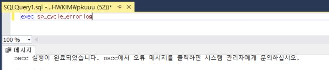
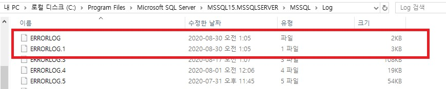

## 목적
- DB C드라이브 용량 증가 문제중 ErrorLog의 용량이 커진 경우 조치 사항
___

## 해결방법
- sp_cycle_errorlog, DBCC errorlog 이용 결과는 동일
- sp_cycle_errorlog : 현재 오류 로그 파일 종료, 서버 재시작과 같이 오류 로그 확정 번호 순환 생성  
___

## 실행내역
- errorlog 파일 확인

___

- sp_cycle_rrorlog 사용

___

- errorlog 파일 확인 -> 기존내역 ERRORLOG.1로변경, 신규 ERRORLOG발생

___

## 결론
- ErrorLog의 용량이 커진 경우 sp_cycle_rrorlog을 이용하여 기존 errlog파일을 타 폴더에 백업 또는 삭제처리하여 C드라이브 용량 확보 가능
